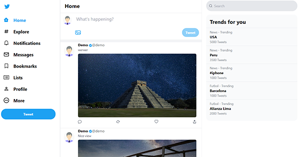
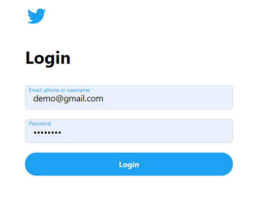
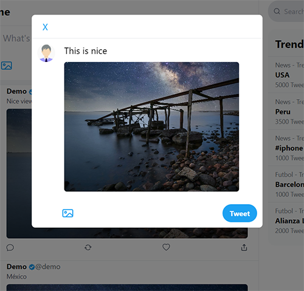
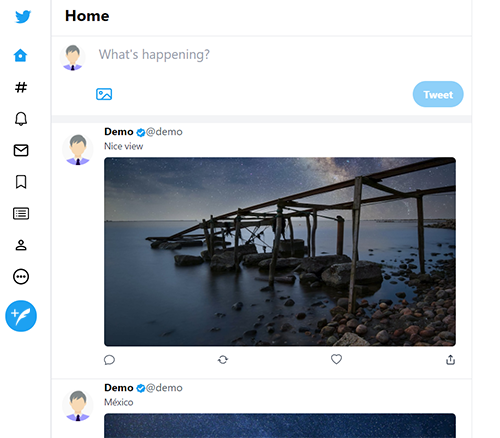

## Twitter Clone With React

This open source project was made with:

* Reactjs
* Redux
* Tailwind
* Jest/Enzyme






## Installation

### Prerequisites

* To run this project, you must have the latest version of nodejs and install the backend

### Step 1

 Begin by cloning this repository to your machine, and installing all NPM dependencies.

```bash
git clone https://github.com/lupanvi/react-twitter-frontend.git
cd react-twitter-frontend
npm install && npm run dev
```

### Step 2

Install the backend for this project: [react-twitter-backend](https://github.com/lupanvi/react-twitter-backend)

### Step 3

```bash
git clone https://github.com/lupanvi/react-twitter-frontend.git
cd react-twitter-frontend
npm install && npm run dev
```

### Step 4

Next, boot up a server and visit your laragram frontend app. 

```bash
npm run start
```

1. Visit: `http://localhost:8080/login` and write the demo credentials:
	user: demo@gmail.com , password: 12345678 , and press the login button
2. You will be redirected to the home page, where you can see all the tweets
